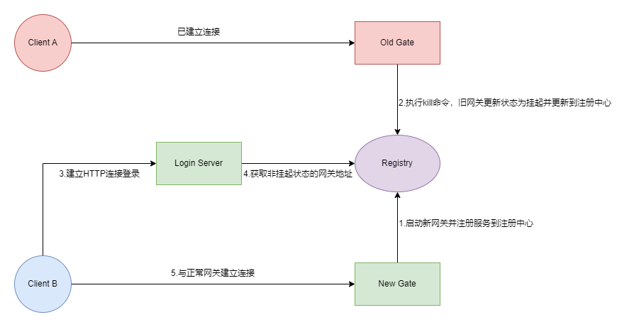
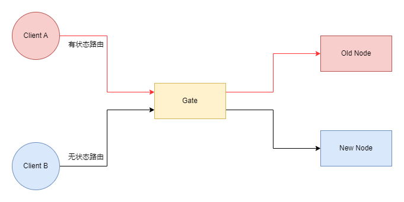

# 2.12 滚动更新

## 2.12.1 基础介绍

在游戏服务器开发中要想做到非常完美的热更其实是非常难的，在 [due](https://github.com/dobyte/due) 框架中也提供给大家一种相对完美的解决方案，可以在不影响游戏运行的情况下对游戏服务器进行滚动更新。

## 2.12.2 网关服更新

其实，在 [due](https://github.com/dobyte/due) 框架中网关服（Gate）仅做路由消息转发，也不提供任何业务逻辑开发的接口。因此，网关服（Gate）的更新完全是多此一举的存在。但是，为了某些特殊场景下的更新，框架底层也提供了较为完善的滚动更新方案来进行更新维护。下面详细讲叙一下框架是如何对网关服（Gate）进行滚动更新的：

1. 准备好一台新的网关服（Gate）并启动它，此时框架底层会自动注册一个新的网关服务到注册中心（Registry）
2. 在旧的网关服（Gate）上执行kill命令，此时框架底层会接收到关闭信号并启动关闭流程
3. 网关服（Gate）会先将自身状态变更为挂起（[cluster.Hang](https://github.com/dobyte/due/blob/main/cluster/cluster.go)）状态，然后将状态同步到注册中心（Registry）
4. 新用户或断线老用户会重新走登录流程（账号密码登录、验证Token登录等），并获取到最新非挂起状态的网关服务器地址
5. 新用户或断线老用户通过返回的连接地址与新的网关服（Gate）建立连接，而在旧的网关服（Gate）上建立连接的用户会不受影响。
6. 至此，新的网关服（Gate）完美接替旧的网关服（Gate）完成更新。旧的节点服（Node）也会在所有连接断开后或到达服务器设置的最大等待时间（[etc.shutdownMaxWaitTime](https://github.com/dobyte/due/blob/main/testdata/etc/etc.toml)）后进行销毁。

在上述更新方案中，网关服（Gate）的流量控制是通过登录服返回的连接地址来控制的，这种方案比较原始，也比较粗糙的。如果你采用的是K8S方案来进行集群部署的话，你完全可以忽略掉登录服控制流量的步骤，K8S会自动将流量打到新起的网关服（Gate）上。

## 2.12.3 节点服更新

鉴于节点服（Node）多用于有状态服务的开发，节点服（Node）需要在保证用户体验和数据安全的前提下进行更新维护。为此，框架底层也提供了较为完善的滚动更新方案来进行更新维护。下面详细讲叙一下框架是如何对节点服（Node）进行滚动更新的：

1. 准备好一台新的节点服（Node）并启动它，此时框架底层会自动注册一个新的节点服务到注册中心（Registry）
2. 在旧的节点服（Node）上执行kill命令，此时框架底层会接收到关闭信号并启动关闭流程
3. 节点服（Node）会先将自身状态变更为挂起（[cluster.Hang](https://github.com/dobyte/due/blob/main/cluster/cluster.go)）状态，然后将状态同步到注册中心（Registry）
4. 节点服（Node）此时会同步阻塞，等待**内部业务**处理完成
5. 网关服（Gate）接收到节点服（Node）状态变更时，会更新本地路由表信息，后续的有无状态路由会忽略掉处于挂起状态的节点服（Node），而有状态路由会依然根据绑定关系继续到达相应的节点服（Node）。此时旧的节点服（Node）不再接收新玩家业务，待到老玩家业务逐步完成后，旧的节点服（Node）会自动解除阻塞并进行销毁。
6. 至此，新的节点服（Node）完美接替旧的节点服（Node）完成新功能的更新。旧的节点服（Node）也会在完成老玩家业务后或到达服务器设置的最大等待时间（[etc.shutdownMaxWaitTime](https://github.com/dobyte/due/blob/main/testdata/etc/etc.toml)）后进行销毁。

在上述滚动更新流程中提到了节点服（Node）会同步阻塞，等待**内部业务**处理完成。那么哪些业务可以被称之为**内部业务**而被关闭流程等待呢？

1. 通过ctx.BindNode或proxy.BindNode绑定到节点服的用户
2. 通过ctx.Spawn或proxy.Spawn创建的Actor实例
3. 通过ctx.Task投递到到任务池的任务
4. 通过proxy.Invoke投递到队列中的的处理函数
5. 通过proxy.AfterFunc调用的延迟处理函数
6. 通过proxy.AfterInvoke调用的延迟处理函数

这里需要明确解释一下为什么没有将路由消息作为**内部业务**，主要是因为节点服（Node）处于挂起状态时，节点仅处理绑定到本节点的用户路由消息，因此只需关注节点服（Node）绑定的用户数就足够了。

## 2.12.4 网格服更新

在 [due](https://github.com/dobyte/due) 框架中网格服（Mesh）被定义为一种无状态的微服务器。因此，网格服（Mesh）的更新是没有任何限制的，可以做到随时更新。我们也可以利用网格服（Mesh）的这一特性来合理地规划我们的业务模块，将一些无状态的或频繁改动的业务都规划到网格服（Mesh）上，从而为后续的业务扩展和更新做好充分的准备。
