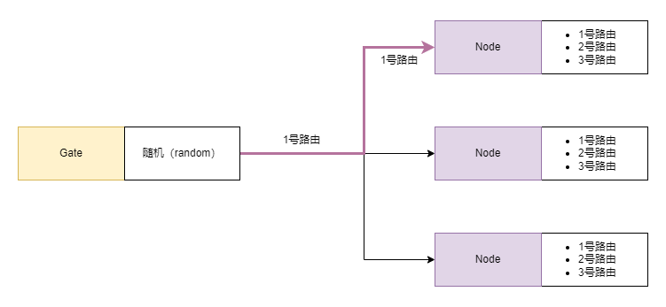
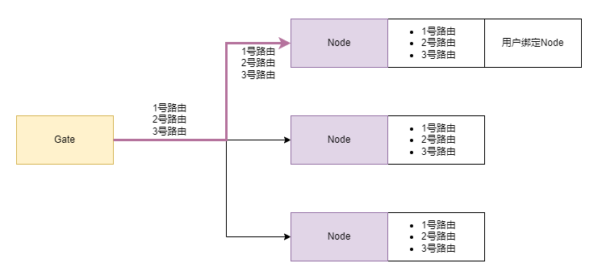
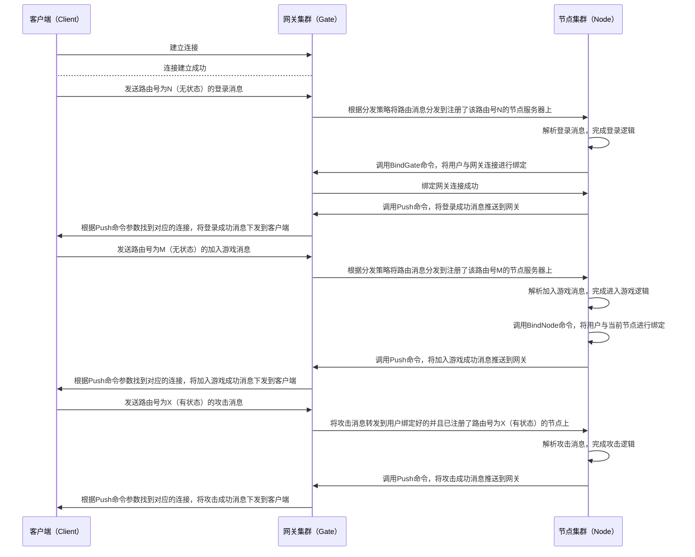

# 2.3 路由设计

## 2.3.1 路由注册

在游戏服务器中，路由（route）作为消息（message）的标识，为消息在整个业务系统中的流转提供支撑。在[due](https://github.com/dobyte/due)框架中，路由处理器会被提前添加到节点服（Node）上，在节点服（Node）启动时随着节点服信息一同被注入到注册中心（registry）中；集群中的其他服务器会通过服务发现（discovery）获取到这一节点服（Node）的相关信息。

## 2.3.2 路由状态

在[due](https://github.com/dobyte/due)框架中，路由被设计成了无状态（stateless）和有状态（stateful）两种模式。两种路由模式分别对应着分布式集群中不同的路由分发机制。但无论是哪种路由模式，一个路由号只能对应一种路由模式。

- 无状态路由（stateless route）：无状态路由与HTTP路由比较类似。当网关服（Gate）接收到无状态路由消息后会根据一定的[分发策略](/guide/v2/route.md#route-stateless-dispatch)分发到对应的节点服（Node）进行消息处理。

- 有状态路由（stateful route）：有状态路由主要解决的是游戏业务中的消息定向转发问题。

## 2.3.3 无状态路由分发

- 随机（random）：默认策略，网关服（Gate）在接收到无状态路由消息后会在已注册该路由号的节点服（Node）中随机选择一个节点服（Node）进行消息转发。
- 轮询（rr）：网关服（Gate）在接收到无状态路由消息后会在已注册该路由号的节点服（Node）中按照顺序依次转发到对应的节点服（Node）。
- 加权轮询（wrr）：网关服（Gate）在接收到无状态路由消息后会在已注册该路由号的节点服（Node）中按照节点服（Node）权重高低依次转发到对应的节点服（Node）。

## 2.3.4 有状态路由定向转发

要深入理解有状态路由的工作机制，我们需要先理清网关服（Gate）、节点服（Node）、用户（user）、有状态路由（stateful route）四者之间的关系，这里的路由（route）特指有状态路由（stateful route）。

- 首先，一个节点服（Node）可以注册多个有状态路由（stateful route）处理器；此时，我们可以将这个节点服（Node）上注册的所有路由看作是一个路由组（route group）。
- 其次，有状态路由（stateful route）是为了将某个用户（user）的消息引导至某一个特定的节点服（Node）上而设计的，那么有状态路由（stateful route）在进行消息转发前用户（user）必需与网关服（Gate）建立绑定关系。
- 最后，为了让某个用户（user）的有状态路由消息（message）能够被网关服（Gate）转发到特定的节点服（Node）上，我们还需要将用户（user）与节点服（Node）建立绑定关系。

在理清了这四者之间的关系后，我们就可以更加清晰地了解到有状态路由的工作机制了。

## 2.3.5 消息流转

以下用一个简单的流程图来模拟玩家从建立连接到发起登录、再到加入战斗、最后到攻击怪物的整个消息流转过程。

