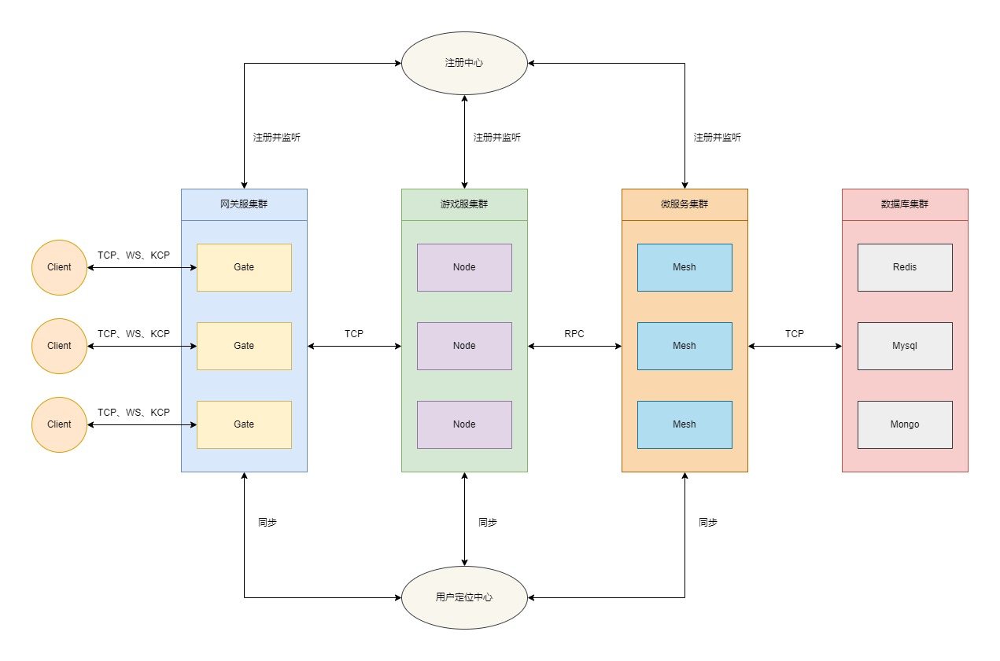

# 框架介绍 {#introduction}

## 简介 {#summary}

due是一款基于Go语言开发的高性能分布式游戏服务器框架。其中，模块设计方面借鉴了[kratos](https://github.com/go-kratos/kratos)的模块设计思路，旨在为游戏服务器开发提供完整、高效、标准化的解决方案。

## 架构 {#architecture}

* Gate：网关服。主要用于客户端连接管理，接收并转发客户端消息到后端Node节点服。同时接收来自Node节点服和Mesh网格服的推送消息并转发至对应的客户端。
* Node：节点服。主要用于接收和处理经过Gate网关服转发过来的客户端消息，并将处理后的结果通过Gate网关服转发至对应的客户端。同时Node节点服也可以通过注册RPC调用函数来扩展Node节点服的额外能力。
* Mesh: 网格服。主要用于构建无状态的微服务以提供给Node服务器调用。

## 优势 {#advantages}

* 免费性：框架遵循MIT协议，完全开源免费。
* 简单性：架构简单，源码简洁易理解。
* 便捷性：仅暴露必要的调用接口，减轻开发者的心智负担。
* 高性能：框架原生实现集群通信方案，普通机器单线程也能轻松实现20W的TPS。
* 高效性：框架原生提供tcp、kcp、ws等协议的服务器，方便开发者快速构建各种类型的网关服务器。
* 扩展性：采用良好的接口设计，方便开发者设计实现自有功能。
* 平滑性：引入信号量，通过控制服务注册中心来实现优雅地重启。
* 扩容性：通过优雅的路由分发机制，理论上可实现无限扩容。
* 易调试：框架原生提供了tcp、kcp、ws等协议的客户端，方便开发者进行独立的调试全流程调试。
* 可管理：提供完善的后台管理接口，方便开发者快速实现自定义的后台管理功能。

## 功能 {#features}

* 网关：支持tcp、kcp、ws等协议的网关服务器。
* 日志：支持std、zap、logrus、aliyun、tencent等多种日志组件。
* 注册：支持consul、etcd、nacos等多种服务注册中心。
* 协议：支持json、protobuf、msgpack等多种通信协议。
* 配置：支持consul、etcd、nacos等多种配置中心；并支持json、yaml、toml、xml等多种文件格式。
* 通信：支持grpc、rpcx等多种高性能通信方案。
* 重启：支持服务器的平滑重启。
* 事件：支持redis、nats、kafka、rabbitMQ等事件总线实现方案。
* 加密：支持rsa、ecc等多种加密方案。
* 服务：支持grpc、rpcx等多种微服务解决方案。
* 灵活：支持单体、分布式等多种架构方案。
* 模型：支持单线程、多协程、Actor三种模型的灵活切换。
* 管理：提供master后台管理服相关接口支持。
* 工具：提供[due-cli](https://github.com/dobyte/due-cli)脚手架工具箱，可快速构建集群项目。
* Web：提供http协议的fiber服务器及swagger文档解决方案。

