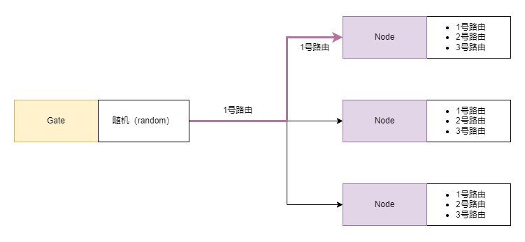
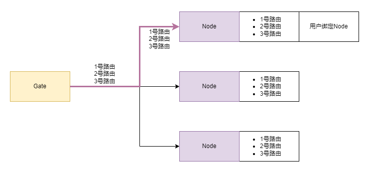
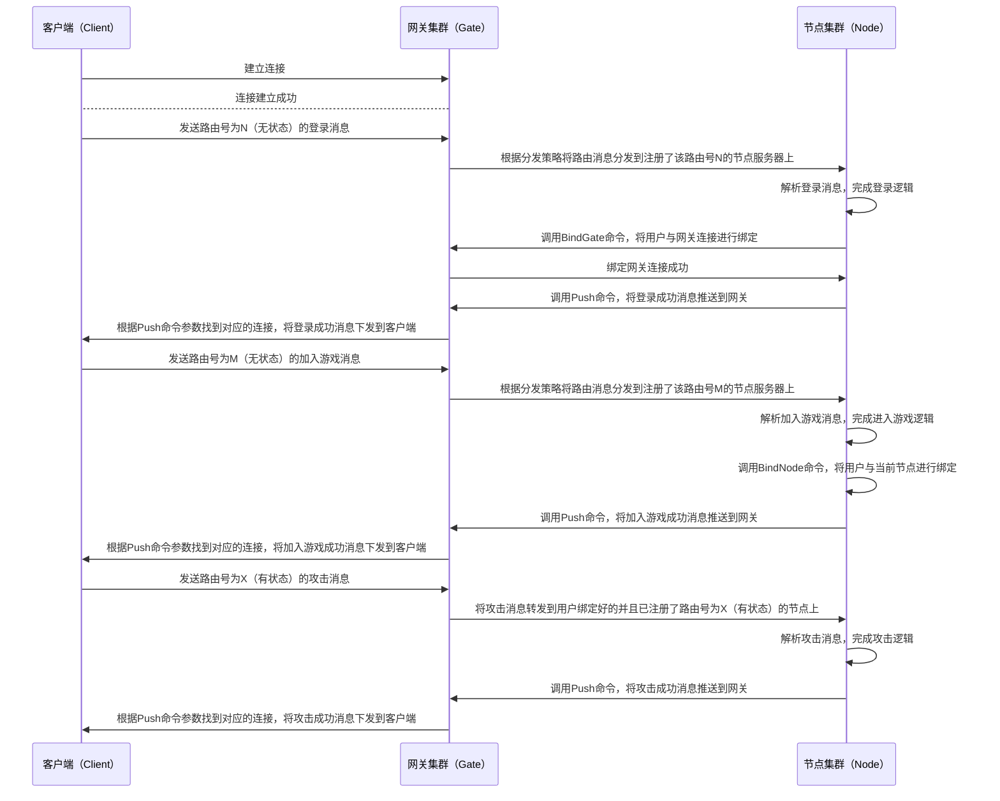

# 路由设计 {#route}

## 路由注册 {#route-register}

在游戏服务器中，路由（route）作为消息（message）的标识，为消息在整个业务系统中的流转提供支撑。在[due](https://github.com/dobyte/due)框架中，路由处理器会被提前添加到节点服（node）上，在节点服启动的时候随着节点服信息一同被注入到注册中心中。集群中的其他服务器会通过服务发现（discovery）获取到这一节点服（node）的相关信息。

```go
// AddRouteHandler 添加路由处理器
AddRouteHandler(route int32, stateful bool, handler RouteHandler, middlewares ...MiddlewareHandler)
```

## 路由状态 {#route-state}

在[due](https://github.com/dobyte/due)框架中，路由被设计成了无状态（stateless）和有状态（stateful）两种模式。两种路由模式分别对应着分布式集群中不同的路由分发机制。但无论是哪种路由模式，一个路由号只能对应一种路由模式。

- 无状态路由（stateless route）：无状态路由与HTTP路由比较类似。当网关（Gate）接收到无状态路由消息后会根据一定的[分发策略](/guide/route.md#route-stateless-dispatch)分发到对应的节点（Node）进行消息处理。

- 有状态路由（stateful route）：有状态路由主要解决的是游戏业务中的消息定向转发问题。


## 无状态路由分发 {#route-stateless-dispatch}




- 随机（random）：默认策略，网关（Gate）在接收到无状态路由消息后会在已注册该路由号的节点（Node）中随机选择一个节点（Node）进行消息转发。
- 轮询（rr）：网关（Gate）在接收到无状态路由消息后会在已注册该路由号的节点（Node）中按照顺序依次转发到对应的节点（Node）。
- 加权轮询（wrr）：网关（Gate）在接收到无状态路由消息后会在已注册该路由号的节点（Node）中按照节点（Node）权重高低依次转发到对应的节点（Node）。

## 有状态路由定向转发 {#route-stateful-forward}



有状态路由要实现定向转发须满足以下两个条件：

- 用户已与他所连接的网关（Gate）建立了绑定关系
- 用户已与某一个节点（Node）建立了绑定关系

在满足以上两个条件后，用户客户端后续发送的有状态路由消息均会被转发到用户绑定的节点（Node）上。

## 消息流转

以下用一个简单的流程图来模拟玩家从建立连接到发起登录、再到加入战斗、最后到攻击怪物的整个消息流转过程。


